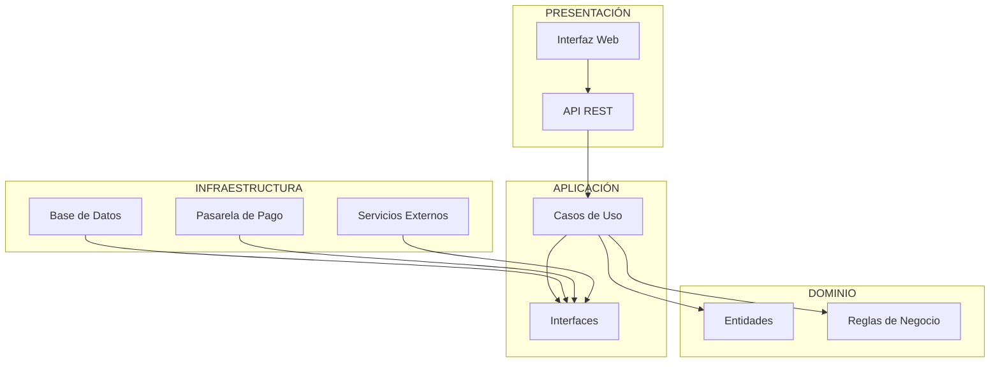

# Enfoque arquitectónico

## 1. Enfoque seleccionado

Para el Marketplace de productos para mascotas se utilizará **Clean Architecture (Arquitectura Limpia)** como enfoque arquitectónico interno.

Este enfoque permitirá organizar las responsabilidades del sistema y controlar la dirección de las dependencias, manteniendo las reglas del negocio independientes de los detalles tecnológicos.

## 2. Objetivo

El objetivo es separar las responsabilidades del sistema y mantener el dominio del negocio como núcleo de la solución.

Las dependencias deberán dirigirse hacia las capas internas, evitando que el dominio dependa directamente de frameworks, bases de datos o servicios externos.

## 3. Problema que resuelve

El Marketplace integra diferentes funcionalidades, entre ellas:

- Gestión de usuarios.
- Gestión de productos.
- Catálogo.
- Carrito de compras.
- Pedidos.
- Pagos.

Sin una adecuada separación de responsabilidades, estas funcionalidades podrían quedar fuertemente acopladas a la interfaz, base de datos o servicios externos.

Clean Architecture permite reducir este acoplamiento mediante una separación clara de responsabilidades.

## 4. Capas de Clean Architecture

### 4.1 Dominio

Contiene las entidades y reglas principales del negocio.

Ejemplos:

- Usuario.
- Producto.
- Carrito.
- Pedido.
- Pago.

Ejemplos de reglas de negocio:

- No permitir comprar una cantidad superior al stock disponible.
- Un pedido debe contener productos válidos.
- Un pedido no debe confirmarse si el pago no ha sido validado.
- Los datos principales del negocio deben mantenerse independientes de la tecnología utilizada.

El dominio no deberá depender de frameworks ni tecnologías externas.

### 4.2 Aplicación

Contiene los casos de uso que coordinan las operaciones del sistema.

Ejemplos:

- RegistrarUsuario.
- AutenticarUsuario.
- RegistrarProducto.
- ActualizarProducto.
- ConsultarCatalogo.
- AgregarProductoAlCarrito.
- CrearPedido.
- ValidarPago.
- ConsultarPedido.

Esta capa coordina las operaciones necesarias para ejecutar los casos de uso del sistema.

### 4.3 Infraestructura

Contiene las implementaciones concretas necesarias para interactuar con tecnologías externas.

Ejemplos:

- Repositorios de datos.
- Acceso a la base de datos.
- Adaptador de la pasarela de pago.
- Servicios externos.

La infraestructura implementará las interfaces necesarias definidas por las capas internas.

### 4.4 Presentación

Es responsable de recibir las solicitudes de los usuarios y presentar los resultados.

Incluye:

- Interfaz web.
- Controladores.
- API REST.

La presentación enviará las solicitudes hacia los casos de uso de la capa de aplicación.

## 5. Regla de dependencias

Las dependencias deberán dirigirse hacia las capas internas.

La relación general será:

```text
Presentación
      ↓
Aplicación
      ↓
Dominio
```

La infraestructura podrá implementar las interfaces utilizadas por la aplicación y el dominio.

El dominio no deberá depender directamente de:

- Frameworks.
- Base de datos.
- Interfaz de usuario.
- Pasarela de pago.
- Servicios externos.

## 6. Relación con los drivers arquitectónicos

Clean Architecture responde principalmente al:

- **DA-06 – Mantenibilidad / evolución modular.**

La separación de responsabilidades permite modificar determinados componentes sin afectar innecesariamente las reglas principales del negocio.

También contribuye indirectamente a los requisitos relacionados con seguridad y evolución del sistema al mantener separadas las responsabilidades.

## 7. Beneficios

- Facilita el mantenimiento del sistema.
- Reduce el acoplamiento entre componentes.
- Separa las reglas del negocio de las tecnologías externas.
- Facilita las pruebas de las reglas de negocio.
- Permite sustituir tecnologías externas con menor impacto.
- Favorece la evolución modular del sistema.

## 8. Diagrama del enfoque arquitectónico



## 9. Resultado

El Marketplace utilizará **Clean Architecture como enfoque arquitectónico interno**, manteniendo las reglas del negocio en el núcleo y separándolas de la presentación, persistencia y servicios externos.

Este enfoque complementará el estilo de **Monolito Modular**, permitiendo organizar internamente cada módulo con responsabilidades claramente separadas.