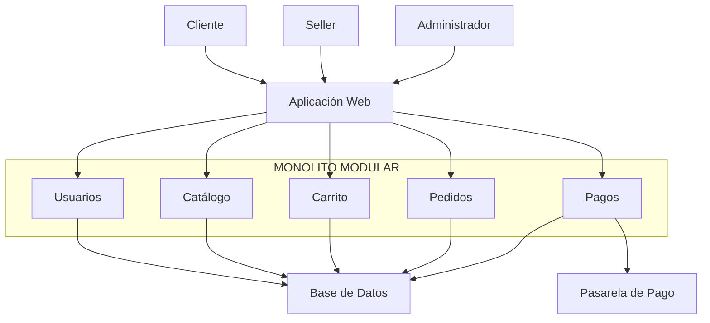

# Estilo arquitectónico

## 1. Estilo seleccionado

Para el Marketplace de productos para mascotas se utilizará un **Monolito Modular** como estilo arquitectónico principal.

Este estilo permite organizar las funcionalidades del sistema en módulos independientes, manteniendo inicialmente una única aplicación desplegable.

## 2. Justificación

El sistema requiere gestionar diferentes funcionalidades como usuarios, productos, catálogo, carrito, pedidos y pagos.

El monolito modular permite separar estas responsabilidades en módulos, facilitando el mantenimiento y la evolución del sistema sin introducir inicialmente la complejidad de múltiples servicios independientes.

## 3. Módulos principales

Los principales módulos del sistema serán:

- Usuarios
- Catálogo
- Carrito
- Pedidos
- Pagos

Cada módulo tendrá responsabilidades relacionadas con una parte específica del negocio.

## 4. Estructura general

El estilo arquitectónico se representa de la siguiente manera:

## 5. Relación con los drivers arquitectónicos

El estilo de monolito modular responde principalmente a:

- **DA-01 – Escalabilidad:** permite organizar las funcionalidades en módulos y facilitar la evolución de la aplicación.
- **DA-06 – Mantenibilidad / evolución modular:** permite separar responsabilidades y reducir el impacto de los cambios entre funcionalidades.

## 6. Resultado

El Marketplace se organizará inicialmente como un **Monolito Modular**, donde los módulos de Usuarios, Catálogo, Carrito, Pedidos y Pagos formarán parte de una misma aplicación.

Este estilo define la estructura global del sistema. Posteriormente, **Clean Architecture** permitirá organizar las responsabilidades y dependencias internas de los módulos.